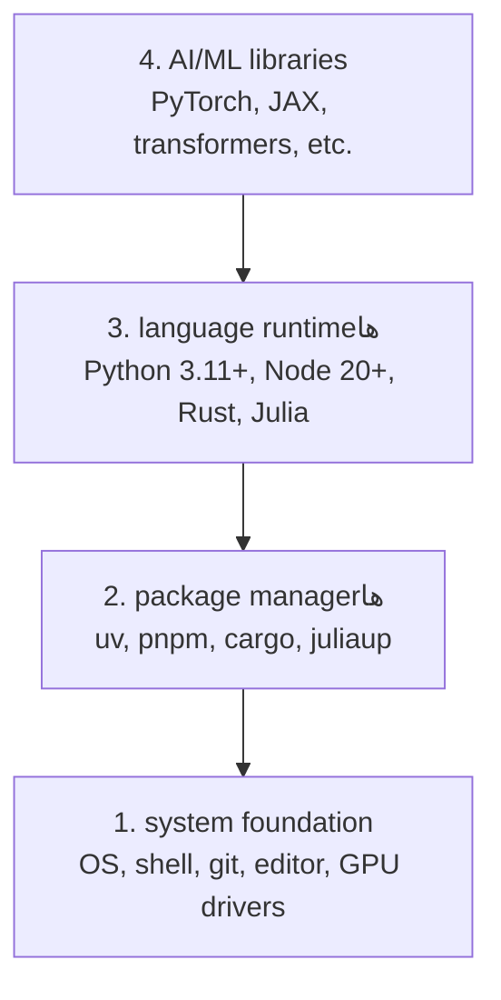

# محیط توسعه

> ابزارهای شما شیوهٔ فکرتان را شکل می‌دهند. آن‌ها را یک‌بار، درست پیکربندی کنید.

**Type:** ساخت
**Languages:** Python, Node.js, Rust
**Prerequisites:** هیچ‌کدام
**Time:** حدود 45 دقیقه

## اهداف یادگیری

- toolchain (زنجیرهٔ ابزار) مربوط به Python 3.11+، Node.js 20+ و Rust را از ابتدا راه‌اندازی کنید
- محیط‌های مجازی و package managerها (مدیران بسته) را برای reproducible buildها (buildهای قابل‌بازتولید) پیکربندی کنید
- دسترسی GPU را با CUDA/MPS بررسی کنید و یک tensor operation (عملیات تانسور) آزمایشی اجرا کنید
- پشتهٔ چهارلایهٔ system foundation (زیربنای سیستم)، packageها (بسته‌ها)، language runtimeها و AI libraries (کتابخانه‌های AI) را درک کنید

## مسئله

قرار است در بیش از 200 درس، مهندسی AI را با Python، TypeScript، Rust و Julia یاد بگیرید. اگر محیطتان خراب باشد، هر درس به‌جای یادگیری، به نبردی با ابزارها تبدیل می‌شود.

بیشتر افراد راه‌اندازی محیط را نادیده می‌گیرند. بعد ساعت‌ها صرف رفع خطاهای import، تداخل نسخه‌ها و نبود درایورهای CUDA می‌کنند. ما این کار را همین یک‌بار، درست انجام می‌دهیم.

## مفهوم

یک محیط مهندسی AI چهار لایه دارد:



نصب را از پایین به بالا انجام می‌دهیم. هر لایه به لایهٔ زیر خود وابسته است.

## آن را بسازید

### گام 1: system foundation (زیربنای سیستم)

سیستم خود را بررسی کنید و ابزارهای پایه را نصب کنید.

```bash
# macOS
xcode-select --install
brew install git curl wget

# Ubuntu/Debian
sudo apt update && sudo apt install -y build-essential git curl wget

# Windows (use WSL2)
wsl --install -d Ubuntu-24.04
```

### گام 2: Python با uv

از `uv` استفاده می‌کنیم — 10 تا 100 برابر از pip سریع‌تر است و محیط‌های مجازی را خودکار مدیریت می‌کند.

```bash
curl -LsSf https://astral.sh/uv/install.sh | sh

uv python install 3.12

uv venv
source .venv/bin/activate  # or .venv\Scripts\activate on Windows

uv pip install numpy matplotlib jupyter
```

بررسی کنید:

```python
import sys
print(f"Python {sys.version}")

import numpy as np
print(f"NumPy {np.__version__}")
a = np.array([1, 2, 3])
print(f"Vector: {a}, dot product with itself: {np.dot(a, a)}")
```

### گام 3: Node.js با pnpm

برای TypeScript lessonها (درس‌های TypeScript؛ ایجنت‌ها، سرورهای MCP و برنامه‌های وب).

```bash
curl -fsSL https://fnm.vercel.app/install | bash
fnm install 22
fnm use 22

npm install -g pnpm

node -e "console.log('Node', process.version)"
```

**macOS / Apple Silicon (M1/M2/M3/M4):** اگر نصب‌کننده با `Error: Cannot install under Rosetta 2 in ARM default prefix (/opt/homebrew)` متوقف شد، ترمینال شما زیر Rosetta 2 اجرا می‌شود (`arch` مقدار `i386` چاپ می‌کند)، درحالی‌که Homebrew یک ساخت بومی arm64 است. fnm را با اجبار arm64 نصب کنید، آن را به shell خود متصل کنید، سپس فرمان‌های بالا را از `fnm install 22` دوباره اجرا کنید:

```bash
arch -arm64 brew install fnm
echo 'eval "$(fnm env --use-on-cd)"' >> ~/.zshrc
source ~/.zshrc
```

### گام 4: Rust

برای درس‌های performance-critical (نیازمند کارایی بالا؛ استنتاج و سیستم‌ها).

```bash
curl --proto '=https' --tlsv1.2 -sSf https://sh.rustup.rs | sh

rustc --version
cargo --version
```

### گام 5: Julia (اختیاری)

برای math-heavy lessonها (درس‌های سنگین ریاضی) که Julia در آن‌ها می‌درخشد.

```bash
curl -fsSL https://install.julialang.org | sh

julia -e 'println("Julia ", VERSION)'
```

### گام 6: GPU setup (راه‌اندازی GPU؛ اگر GPU دارید)

**NVIDIA (Linux / Windows):**

```bash
nvidia-smi

# Install PyTorch with CUDA
uv pip install torch torchvision torchaudio --index-url https://download.pytorch.org/whl/cu124
```

**macOS / Apple Silicon (M1/M2/M3/M4):** CUDA روی Mac وجود ندارد — این وضعیت طبیعی است، نه خطا. `--index-url .../cuXXX` را **اضافه نکنید** (این wheelها فقط برای Linux/Windows هستند و نصب را شکست می‌دهند). standard build (build معمولی) را نصب کنید که GPU backend (بک‌اند GPU) مربوط به MPS (Metal) اپل را شامل می‌شود:

```bash
uv pip install torch torchvision torchaudio
```

بررسی کنید (روی هر پلتفرمی کار می‌کند):

```python
import torch
print(f"CUDA available: {torch.cuda.is_available()}")           # False on macOS — expected
print(f"MPS available:  {torch.backends.mps.is_available()}")   # True on Apple Silicon
if torch.cuda.is_available():
    print(f"GPU: {torch.cuda.get_device_name(0)}")
```

GPU ندارید؟ مشکلی نیست. بیشتر درس‌ها با CPU کار می‌کنند. برای درس‌هایی که آموزش مدل در آن‌ها سنگین است، از Google Colab یا GPUهای ابری استفاده کنید.

### گام 7: verification (بررسی) همه‌چیز

اسکریپت بررسی را اجرا کنید:

```bash
python phases/00-setup-and-tooling/01-dev-environment/code/verify.py
```

## از آن استفاده کنید

اکنون محیط شما برای تمام درس‌های این دوره آماده است. در ادامه می‌بینید هر مورد را کجا استفاده خواهید کرد:

| زبان       | کاربرد                                             | package manager |
| ---------- | -------------------------------------------------- | --------- |
| Python     | فازهای 1 تا 12 (ML، DL، NLP، Vision، Audio، LLMها) | uv        |
| TypeScript | فازهای 13 تا 17 (Tools، Agents، Swarms، Infra)     | pnpm      |
| Rust       | فازهای 12، 15 تا 17 (سیستم‌های نیازمند کارایی بالا) | cargo     |
| Julia      | فاز 1 (مبانی ریاضی)                                | Pkg       |

## آن را عرضه کنید

این درس یک verification script (اسکریپت بررسی) تولید می‌کند که هر کسی می‌تواند برای بررسی وضعیت محیط خود اجرا کند.

برای prompt (درخواست/دستور) که به دستیارهای AI کمک می‌کند مشکلات محیط را عیب‌یابی کنند، `outputs/prompt-env-check.md` را ببینید.

## تمرین‌ها

1. اسکریپت بررسی را اجرا کنید و هر شکست را برطرف کنید
2. برای این دوره یک محیط مجازی Python بسازید و PyTorch را نصب کنید
3. در هر چهار زبان یک «hello world» بنویسید و هرکدام را اجرا کنید
