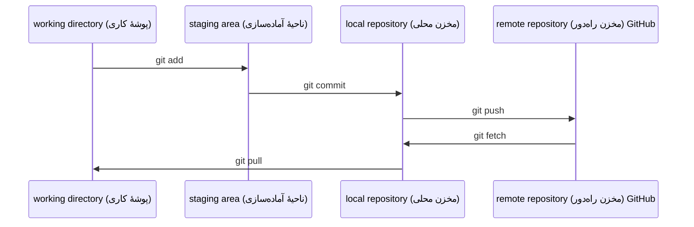

# Git & Collaboration

> version control (کنترل نسخه) اختیاری نیست. هر آزمایش، هر مدل و هر درسی که اینجا می‌سازید، ثبت و پیگیری می‌شود.

**Type:** یادگیری
**Languages:** --
**Prerequisites:** فاز 0، درس 01
**Time:** حدود 30 دقیقه

## اهداف یادگیری

- Git identity (هویت کاربری Git) را پیکربندی کنید و از daily workflow (گردش‌کار روزانه) `add`، `commit` و `push` استفاده کنید
- برای آزمایش‌های جداگانه، بدون خراب کردن `main`، branch (شاخه) بسازید و آن را merge (ادغام) کنید
- یک `.gitignore` بنویسید که model checkpointها (checkpointهای مدل) و binary fileهای بزرگ (فایل‌های باینری) را از repository خارج کند
- با `git log` در commit history (تاریخچهٔ commitها) جابه‌جا شوید تا تکامل پروژه را درک کنید

## مسئله

قرار است در 20 فاز، صدها فایل کد بنویسید. بدون version control، کارتان را از دست می‌دهید، چیزهایی را خراب می‌کنید که امکان بازگرداندنشان را ندارید و راهی برای همکاری با دیگران نخواهید داشت.

Git ابزار این کار است. GitHub محل میزبانی کد است. این درس فقط چیزهایی را پوشش می‌دهد که برای این دوره لازم دارید.

## مفهوم



سه نکته را به خاطر بسپارید:

1. مرتب commit کنید (`git commit`)
2. به remote repository (مخزن راه‌دور) push کنید (`git push`)
3. برای آزمایش‌ها branch بسازید (`git checkout -b experiment`)

## آن را بسازید

### گام 1: Git را پیکربندی کنید

```bash
git config --global user.name "Your Name"
git config --global user.email "you@example.com"
```

### گام 2: daily workflow (گردش‌کار روزانه)

```bash
git status
git add file.py
git commit -m "Add perceptron implementation"
git push origin main
```

### گام 3: branching (شاخه‌سازی) برای آزمایش‌ها

```bash
git checkout -b experiment/new-optimizer

# ... make changes, commit ...

git checkout main
git merge experiment/new-optimizer
```

### گام 4: کار با course repository (مخزن دوره)

نمی‌توانید مستقیماً به course repository (مخزن دوره) push کنید — فقط maintainerها دسترسی نوشتن دارند. ابتدا آن را در GitHub fork کنید (دکمهٔ Fork در بالا سمت راست) تا `origin` به نسخهٔ خودتان اشاره کند:

```bash
git clone https://github.com/YOUR-USERNAME/ai-engineering-from-scratch.git
cd ai-engineering-from-scratch

git checkout -b my-progress
# work through lessons, commit your code
git push origin my-progress
```

## از آن استفاده کنید

برای این course، دقیقاً همین commandها (فرمان‌ها) را لازم دارید:

| Command (فرمان)          | When (زمان استفاده)              |
| ------------------------ | --------------------------------- |
| `git clone`              | Get course repository (دریافت مخزن دوره) |
| `git add` + `git commit` | Save your work (ذخیرهٔ کارتان)         |
| `git push`               | Back it up to GitHub (پشتیبان‌گیری در GitHub) |
| `git checkout -b`        | Experiment without breaking `main` (آزمایش بدون خراب کردن `main`) |
| `git log --oneline`      | See your history (دیدن تاریخچهٔ کارها) |

همین است. برای این دوره به rebase، cherry-pick یا submodule نیاز ندارید.

## تمرین‌ها

1. این repository را fork کنید، fork خود را clone کنید، branchی به نام `my-progress` بسازید، یک فایل ایجاد کنید، آن را commit و push کنید
2. یک `.gitignore` بسازید که model checkpoint fileها (فایل‌های checkpoint مدل) (`.pt`، `.pth`، `.safetensors`) را حذف کند
3. commit history این repository را با `git log --oneline` ببینید و بخوانید درس‌ها چگونه اضافه شده‌اند

## واژگان کلیدی

| اصطلاح | چیزی که مردم می‌گویند | معنای واقعی                                                      |
| ------ | --------------------- | ---------------------------------------------------------------- |
| Commit | «ذخیره کردن»          | snapshot کامل پروژه در یک لحظهٔ مشخص                             |
| Branch | «یک کپی»              | pointer (اشاره‌گر) به یک commit که هنگام کار شما به جلو حرکت می‌کند |
| Merge  | «ترکیب کد»            | گرفتن تغییرات از یک branch و اعمال آن‌ها روی branch دیگر          |
| Remote | «فضای ابری»           | نسخه‌ای از repository شما که در جای دیگری میزبانی می‌شود (GitHub، GitLab) |
