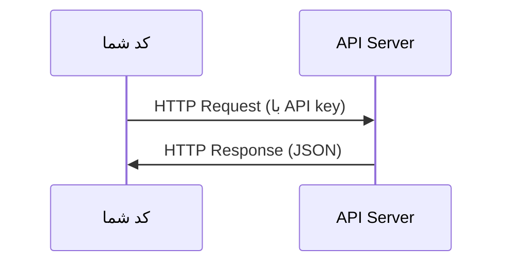

# APIs & Keys

> همهٔ AI APIها یکسان کار می‌کنند: یک request می‌فرستید و یک response می‌گیرید. جزئیات تغییر می‌کند، اما الگو ثابت است.

**Type:** ساخت
**Languages:** Python, TypeScript
**Prerequisites:** فاز 0، درس 01
**Time:** حدود 30 دقیقه

## اهداف یادگیری

- API keyها را با استفاده از environment variableها و فایل‌های `.env` به‌صورت امن ذخیره کنید
- با استفاده از Anthropic Python SDK و raw HTTP یک LLM API call انجام دهید
- قالب request/response مبتنی بر SDK و raw HTTP را برای debugging مقایسه کنید
- خطاهای رایج API، از جمله authentication و rate limit، را شناسایی و مدیریت کنید

## مسئله

از فاز 11 به بعد، LLM APIها (Anthropic، OpenAI و Google) را فراخوانی می‌کنید. در فازهای 13 تا 16 agentهایی می‌سازید که از این APIها در loopها استفاده می‌کنند. باید بدانید API keyها چگونه کار می‌کنند، چگونه آن‌ها را امن ذخیره کنید و چطور اولین API call خود را انجام دهید.

## مفهوم



هر API call چهار بخش دارد:
1. یک endpoint (URL)
2. یک API key (authentication)
3. یک request body (چیزی که می‌خواهید)
4. یک response body (چیزی که دریافت می‌کنید)

## آن را بسازید

### گام 1: API keyها را امن ذخیره کنید

هرگز API keyها را در کد قرار ندهید. از environment variableها استفاده کنید.

```bash
export ANTHROPIC_API_KEY="sk-ant-..."
export OPENAI_API_KEY="sk-..."
```

یا از یک فایل `.env` استفاده کنید (آن را به `.gitignore` اضافه کنید):

```
ANTHROPIC_API_KEY=sk-ant-...
OPENAI_API_KEY=sk-...
```

### گام 2: اولین API call (Python)

```python
import os

import anthropic

client = anthropic.Anthropic()

MODEL = os.environ.get("LLM_MODEL", "claude-sonnet-5")

response = client.messages.create(
    model=MODEL,
    max_tokens=256,
    messages=[{"role": "user", "content": "What is a neural network in one sentence?"}]
)

print(response.content[0].text)
```

`LLM_MODEL` شناسهٔ مدل Anthropic را انتخاب می‌کند و مقدار پیش‌فرض، alias بدون تاریخ Sonnet است. سایر providerها (OpenAI، Google و دیگران) همین الگوی key به‌علاوهٔ model id را دنبال می‌کنند، اما هرکدام SDK، endpoint و schema مربوط به request/response خود را دارند.

### گام 3: اولین API call (TypeScript)

```typescript
import Anthropic from "@anthropic-ai/sdk";

const client = new Anthropic();

const MODEL = process.env.LLM_MODEL ?? "claude-sonnet-5";

const response = await client.messages.create({
  model: MODEL,
  max_tokens: 256,
  messages: [{ role: "user", content: "What is a neural network in one sentence?" }],
});

console.log(response.content[0].text);
```

### گام 4: raw HTTP (بدون SDK)

```python
import os
import urllib.request
import json

url = "https://api.anthropic.com/v1/messages"
headers = {
    "Content-Type": "application/json",
    "x-api-key": os.environ["ANTHROPIC_API_KEY"],
    "anthropic-version": "2023-06-01",
}
body = json.dumps({
    "model": os.environ.get("LLM_MODEL", "claude-sonnet-5"),
    "max_tokens": 256,
    "messages": [{"role": "user", "content": "What is a neural network in one sentence?"}],
}).encode()

req = urllib.request.Request(url, data=body, headers=headers, method="POST")
with urllib.request.urlopen(req) as resp:
    result = json.loads(resp.read())
    print(result["content"][0]["text"])
```

SDKها در پشت صحنه همین کار را انجام می‌دهند. فهمیدن raw HTTP call هنگام debugging کمک زیادی می‌کند.

## از آن استفاده کنید

برای این دوره:

| API | زمان موردنیاز | Free tier |
|-----|-----------------|-----------|
| Anthropic (Claude) | فازهای 11 تا 16 (agentها، toolها) | اعتبار $5 هنگام ثبت‌نام |
| OpenAI | فاز 11 (مقایسه) | اعتبار $5 هنگام ثبت‌نام |
| Hugging Face | فازهای 4 تا 10 (modelها، datasetها) | رایگان |

همین حالا به همهٔ آن‌ها نیاز ندارید. هرکدام را زمانی setup کنید که درس به آن نیاز دارد.

## آن را عرضه کنید

این درس موارد زیر را تولید می‌کند:
- `outputs/prompt-api-troubleshooter.md` - خطاهای رایج API را تشخیص می‌دهد

## تمرین‌ها

1. یک Anthropic API key بگیرید و اولین API call خود را انجام دهید
2. نسخهٔ raw HTTP را امتحان کنید و قالب response را با نسخهٔ SDK مقایسه کنید
3. عمداً از یک API key نادرست استفاده کنید و پیام خطا را بخوانید

## واژگان کلیدی

| اصطلاح | چیزی که مردم می‌گویند | معنای واقعی |
|------|----------------|------|
| API key | «رمز عبور API» | یک رشتهٔ یکتا که account شما را شناسایی می‌کند و به requestهایتان مجوز می‌دهد |
| Rate limit | «دارند سرعت من را محدود می‌کنند» | حداکثر تعداد request در دقیقه/ساعت برای جلوگیری از سوءاستفاده و تضمین استفادهٔ منصفانه |
| Token | «یک کلمه» (در زمینهٔ API) | واحد billing: tokenهای ورودی و خروجی جداگانه شمارش و محاسبه می‌شوند |
| Streaming | «responseهای لحظه‌ای» | دریافت response کلمه‌به‌کلمه، به‌جای صبر کردن برای response کامل |
