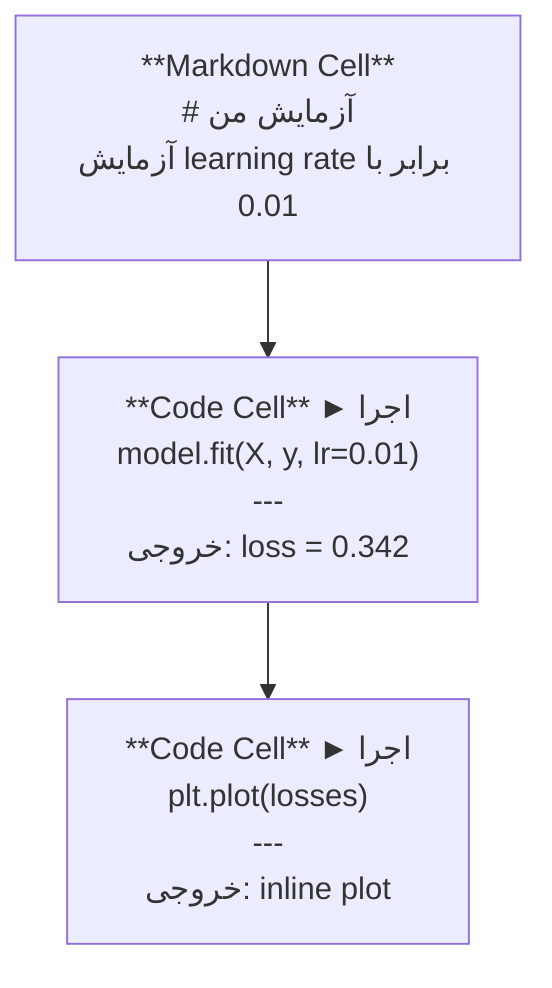
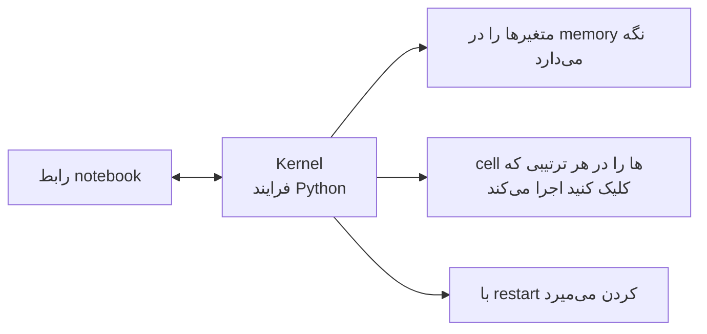

# Jupyter Notebooks

> نوت‌بوک‌ها میز کار آزمایشگاهی مهندسی AI هستند. اینجا نمونه‌سازی می‌کنید و سپس آنچه کار می‌کند را به production منتقل می‌کنید.

**Type:** ساخت
**Languages:** Python
**Prerequisites:** فاز 0، درس 01
**Time:** حدود 30 دقیقه

## اهداف یادگیری

- JupyterLab، Jupyter Notebook یا VS Code را همراه با Jupyter extension نصب و اجرا کنید
- از magic command (دستور ویژهٔ Jupyter) مانند `%timeit`، `%%time` و `%matplotlib inline` برای benchmark (معیارسنجی) و visualization (بصری‌سازی) درون نوت‌بوک استفاده کنید
- تشخیص دهید چه زمانی باید از notebook استفاده کنید و چه زمانی از script، و workflow «کاوش در نوت‌بوک‌ها، عرضه در scriptها» را به کار ببرید
- تله‌های رایج نوت‌بوک، از جمله اجرای خارج از ترتیب، state پنهان و memory leak را شناسایی و از آن‌ها دوری کنید

## مسئله

هر paper، tutorial و رقابت Kaggle در حوزهٔ AI از Jupyter notebook استفاده می‌کند. نوت‌بوک‌ها اجازه می‌دهند کد را بخش‌به‌بخش اجرا کنید، خروجی‌ها را در همان‌جا ببینید، کد را با توضیح ترکیب کنید و سریع تکرار کنید. اگر بخواهید AI را بدون نوت‌بوک یاد بگیرید، مثل این است که تکالیف ریاضی را بدون کاغذ چرک‌نویس انجام دهید.

اما نوت‌بوک‌ها تله‌های واقعی دارند. افراد از آن‌ها برای همه‌چیز استفاده می‌کنند، حتی برای کارهایی که نوت‌بوک در آن‌ها بسیار بد عمل می‌کند. دانستن اینکه چه زمانی از notebook و چه زمانی از script استفاده کنید، شما را از کابوس‌های debugging در آینده نجات می‌دهد.

## مفهوم

یک notebook فهرستی از cellها است. هر cell یا code است یا text.



kernel (کرنل) یک فرایند Python است که در پس‌زمینه اجرا می‌شود. وقتی یک cell را اجرا می‌کنید، کد به kernel فرستاده می‌شود؛ kernel آن را اجرا می‌کند و نتیجه را برمی‌گرداند. همهٔ cellها از یک kernel مشترک استفاده می‌کنند، بنابراین متغیرها بین cellها باقی می‌مانند.



همین بخش «هر ترتیبی که کلیک می‌کنید» هم ابرقدرت نوت‌بوک است و هم نقطه‌ضعف خطرناک آن.

## آن را بسازید

### گام 1: رابط خود را انتخاب کنید

سه گزینه و یک format وجود دارد:

| رابط | نصب | مناسب برای |
|-----------|---------|----------|
| JupyterLab | `pip install jupyterlab` سپس `jupyter lab` | تجربهٔ IDE کامل، چند tab، file browser و terminal |
| Jupyter Notebook | `pip install notebook` سپس `jupyter notebook` | ساده، سبک و یک notebook در هر نوبت |
| VS Code | نصب extension با نام «Jupyter» | وقتی از قبل در editor خود هستید، همراه با git integration و debugging |

هر سه، همان فایل `.ipynb` را می‌خوانند و می‌نویسند. هرکدام را خواستید انتخاب کنید. JupyterLab در کار AI رایج‌ترین گزینه است.

```bash
pip install jupyterlab
jupyter lab
```

### گام 2: میان‌برهای مهم صفحه‌کلید

در دو mode کار می‌کنید. برای command mode (نوار آبی در سمت چپ) `Escape` و برای edit mode (نوار سبز) `Enter` را فشار دهید.

**Command mode (پرکاربردترین):**

| کلید | عملیات |
|-----|--------|
| `Shift+Enter` | اجرای cell و رفتن به cell بعدی |
| `A` | درج cell در بالا |
| `B` | درج cell در پایین |
| `DD` | حذف cell |
| `M` | تبدیل به markdown |
| `Y` | تبدیل به code |
| `Z` | برگرداندن عملیات cell |
| `Ctrl+Shift+H` | نمایش همهٔ میان‌برها |

**Edit mode:**

| کلید | عملیات |
|-----|--------|
| `Tab` | تکمیل خودکار |
| `Shift+Tab` | نمایش signature تابع |
| `Ctrl+/` | روشن/خاموش کردن comment |

`Shift+Enter` همان میان‌بری است که هر روز هزار بار از آن استفاده خواهید کرد. اول همین را یاد بگیرید.

### گام 3: انواع cell

**Code cell**، Python را اجرا می‌کند و خروجی را نشان می‌دهد:

```python
import numpy as np
data = np.random.randn(1000)
data.mean(), data.std()
```

خروجی: `(0.0032, 0.9987)`

**Markdown cell**، متن قالب‌بندی‌شده را render می‌کند. از آن برای مستندسازی کاری که انجام می‌دهید و دلیل آن استفاده کنید. این cell از heading، bold، italic، LaTeX math (`$E = mc^2$`)، table و image پشتیبانی می‌کند.

### گام 4: magic commandها

این‌ها Python نیستند. این‌ها commandهای مخصوص Jupyter هستند که با `%` (line magic) یا `%%` (cell magic) شروع می‌شوند.

**زمان اجرای کد را اندازه بگیرید:**

```python
%timeit np.random.randn(10000)
```

خروجی: `45.2 us +/- 1.3 us per loop`

```python
%%time
model.fit(X_train, y_train, epochs=10)
```

خروجی: `Wall time: 2.34 s`

`%timeit` کد را چند بار اجرا و میانگین‌گیری می‌کند. `%%time` آن را یک‌بار اجرا می‌کند. برای microbenchmark از `%timeit` و برای training run از `%%time` استفاده کنید.

**فعال‌کردن plotهای inline:**

```python
%matplotlib inline
```

از این پس هر `plt.plot()` یا `plt.show()` مستقیماً در notebook render می‌شود.

**نصب package بدون خارج شدن از notebook:**

```python
!pip install scikit-learn
```

پیشوند `!` هر shell command را اجرا می‌کند.

**بررسی environment variableها:**

```python
%env CUDA_VISIBLE_DEVICES
```

### گام 5: نمایش rich output به‌صورت inline

نوت‌بوک‌ها آخرین expression را در یک cell به‌طور خودکار نمایش می‌دهند. اما می‌توانید این نمایش را کنترل کنید:

```python
import pandas as pd

df = pd.DataFrame({
    "model": ["Linear", "Random Forest", "Neural Net"],
    "accuracy": [0.72, 0.89, 0.94],
    "training_time": [0.1, 2.3, 45.6]
})
df
```

این یک HTML table قالب‌بندی‌شده render می‌کند، نه یک text dump. برای plotها هم همین‌طور است:

```python
import matplotlib.pyplot as plt

plt.figure(figsize=(8, 4))
plt.plot([1, 2, 3, 4], [1, 4, 2, 3])
plt.title("Inline Plot")
plt.show()
```

plot درست زیر cell ظاهر می‌شود. به همین دلیل نوت‌بوک‌ها بر کار AI مسلط هستند: داده، plot و کد را در کنار هم می‌بینید.

برای imageها:

```python
from IPython.display import Image, display
display(Image(filename="architecture.png"))
```

### گام 6: Google Colab

Colab یک Jupyter notebook رایگان در cloud است. به شما GPU، libraryهای ازپیش‌نصب‌شده و integration با Google Drive می‌دهد. به setup نیاز ندارید.

1. به [colab.research.google.com](https://colab.research.google.com) بروید
2. هر فایل `.ipynb` از این دوره را upload کنید
3. به Runtime > Change runtime type > T4 GPU (free) بروید

تفاوت‌های Colab با Jupyter محلی:
- فایل‌ها بین sessionها باقی نمی‌مانند (آن‌ها را در Drive ذخیره یا download کنید)
- ازپیش‌نصب‌شده: numpy، pandas، matplotlib، torch، tensorflow، sklearn
- برای upload/download فایل‌ها از `from google.colab import files` استفاده کنید
- برای storage پایدار از `from google.colab import drive; drive.mount('/content/drive')` استفاده کنید
- sessionها پس از 90 دقیقه بی‌فعالیتی timeout می‌شوند (free tier)

## از آن استفاده کنید

### Notebook در برابر Script: چه زمانی از کدام استفاده کنیم

| برای notebook استفاده کنید | برای script استفاده کنید |
|-------------------|-----------------|
| کاوش در dataset | training pipelineها |
| نمونه‌سازی model | utilityهای قابل‌استفادهٔ مجدد |
| visualization نتایج | هر چیزی که `if __name__` دارد |
| توضیح کار خود | کدی که طبق schedule اجرا می‌شود |
| quick experimentها | production code |
| تمرین‌های دوره | packageها و libraryها |

قاعده این است: **در notebook کاوش کنید، در script عرضه کنید.**

یک workflow رایج در AI:
1. داده را در یک notebook کاوش کنید
2. model خود را در notebook نمونه‌سازی کنید
3. وقتی کار کرد، کد را به فایل‌های `.py` منتقل کنید
4. آن فایل‌های `.py` را دوباره در notebook import کنید تا آزمایش‌های بیشتری انجام دهید

### تله‌های رایج

**اجرای خارج از ترتیب.** cell 5 را اجرا می‌کنید، سپس cell 2 و بعد cell 7 را. notebook روی دستگاه شما کار می‌کند، اما وقتی فرد دیگری آن را از ابتدا تا انتها اجرا کند، خراب می‌شود. راه‌حل: پیش از share کردن، Kernel > Restart & Run All را اجرا کنید.

**state پنهان.** یک cell را حذف می‌کنید، اما متغیری که ساخته بود هنوز در memory است. نوت‌بوک تمیز به نظر می‌رسد، ولی به یک ghost cell وابسته است. راه‌حل: kernel را مرتب restart کنید.

**memory leak.** یک dataset چهارگیگابایتی را load می‌کنید، model را train می‌کنید و dataset دیگری را load می‌کنید. هیچ‌چیز آزاد نمی‌شود. راه‌حل: `del variable_name` و `gc.collect()` را اجرا کنید یا kernel را restart کنید.

## آن را عرضه کنید

این درس موارد زیر را تولید می‌کند:
- `outputs/prompt-notebook-helper.md` برای debugging مشکلات notebook

## تمرین‌ها

1. JupyterLab را باز کنید، یک notebook بسازید و با `%timeit`، list comprehension و numpy را برای ساخت آرایه‌ای از 100,000 عدد تصادفی مقایسه کنید
2. یک notebook شامل markdown cell و code cell بسازید که یک CSV را load کند، dataframe را نمایش دهد و یک chart رسم کند. سپس Kernel > Restart & Run All را اجرا کنید تا مطمئن شوید notebook از ابتدا تا انتها کار می‌کند
3. کد `code/notebook_tips.py` را در یک Colab notebook قرار دهید و با یک GPU رایگان اجرا کنید

## واژگان کلیدی

| اصطلاح | چیزی که مردم می‌گویند | معنای واقعی |
|------|----------------|----------------------|
| Kernel | «چیزی که کد من را اجرا می‌کند» | یک فرایند Python جداگانه که cellها را اجرا می‌کند و متغیرها را در memory نگه می‌دارد |
| Cell | «یک code block» | یک واحد مستقل و قابل‌اجرا در notebook که یا code است یا markdown |
| Magic command | «ترفندهای Jupyter» | commandهای ویژه‌ای که با `%` یا `%%` شروع می‌شوند و محیط notebook را کنترل می‌کنند |
| `.ipynb` | «فایل notebook» | یک فایل JSON شامل cellها، outputها و metadata؛ مخفف IPython Notebook |

## مطالعهٔ بیشتر

- [JupyterLab Docs](https://jupyterlab.readthedocs.io/) برای مجموعهٔ کامل قابلیت‌ها
- [Google Colab FAQ](https://research.google.com/colaboratory/faq.html) برای محدودیت‌ها و قابلیت‌های مخصوص Colab
- [28 Jupyter Notebook Tips](https://www.dataquest.io/blog/jupyter-notebook-tips-tricks-shortcuts/) برای میان‌برهای کاربران حرفه‌ای
